# PHP FRAMEWORK (CODE IGNITER)

PHP Framework, seperti CodeIgniter, adalah kumpulan alat dan aturan yang membantu pengembang web untuk membangun aplikasi web dengan lebih cepat dan terstruktur.

Berikut adalah beberapa konsep utama dan manfaat yang dimiliki oleh PHP Framework, seperti CodeIgniter:

1. **Struktur Kode:**
   Framework menyediakan struktur dan organisasi dasar untuk kode aplikasi.

2. **MVC (Model-View-Controller):**
   Sebagian besar framework PHP mengikuti arsitektur MVC. Ini memisahkan aplikasi menjadi tiga komponen utama: Model, View dan Controller.

3. **Database Abstraction:**
   Framework PHP menyediakan lapisan abstraksi database, memungkinkan pengembang untuk berinteraksi dengan database tanpa perlu menulis kueri SQL langsung.

4. **Routing:**
   Framework menyediakan sistem routing yang memetakan URL ke fungsi atau metode tertentu dalam aplikasi.

5. **Library dan Helper:**
   Framework PHP biasanya dilengkapi dengan sejumlah library dan helper yang dapat digunakan untuk tugas umum seperti manipulasi gambar, pengolahan formulir, enkripsi, dan banyak lagi.

6. **Keamanan:**
   Framework PHP sering kali menyediakan mekanisme keamanan bawaan untuk melindungi aplikasi dari ancaman umum seperti SQL injection, cross-site scripting (XSS), dan cross-site request forgery (CSRF).

7. **Skalabilitas dan Kode Bersih:**
   Dengan mengikuti pola dan konvensi tertentu, framework PHP membantu pengembang membuat kode yang bersih dan dapat dikelola.

## Instruksi Praktikum

1. Persiapkan text editor misalnya VSCode.
2. Buat folder baru dengan nama lab11_php_ci pada docroot webserver (htdocs)
3. Ikuti langkah-langkah praktikum yang akan dijelaskan berikutnya.

## Langkah-langkah Praktikum

Persiapan
Sebelum memulai menggunakan Framework Codeigniter, perlu dilakukan konfigurasi pada webserver. Beberapa ekstensi PHP perlu diaktifkan untuk kebutuhan pengembangan Codeigniter 4.

Berikut beberapa ekstensi yang perlu diaktifkan:

- php-json ekstension untuk bekerja dengan JSON;
- php-mysqlnd native driver untuk MySQL;
- php-xml ekstension untuk bekerja dengan XML;
- php-intl ekstensi untuk membuat aplikasi multibahasa;
- libcurl (opsional), jika ingin pakai Curl.

1. Untuk mengaktifkan ekstentsi tersebut, melalu XAMPP Control Panel, pada bagian Apache klik Config -> PHP.ini

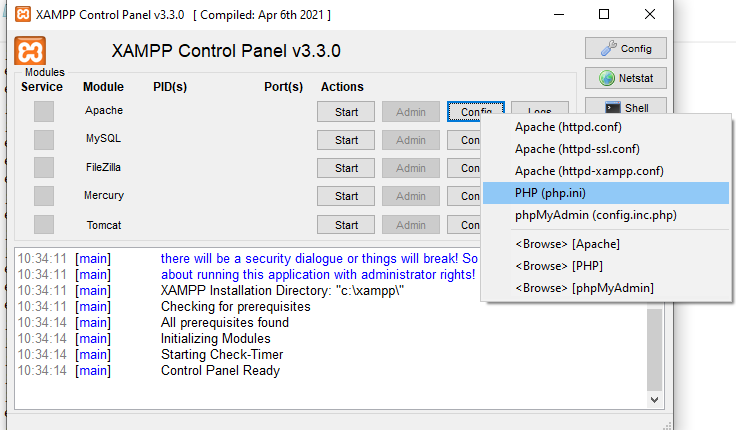

2. Pada bagian extention, hilangkan tanda ; (titik koma) pada ekstensi yang akan diaktifkan. Kemudian simpan kembali filenya dan restart Apache web server.

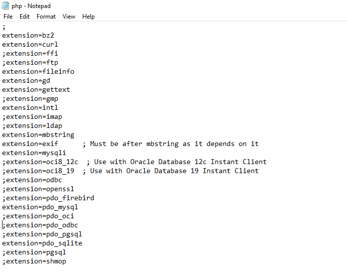

## Instalasi Codeigniter 4

Untuk melakukan instalasi Codeigniter 4 dapat dilakukan dengan dua cara, yaitu cara manual dan menggunakan composer. Pada praktikum ini kita menggunakan cara manual.

- Unduh Codeigniter dari website https://codeigniter.com/download
- Extrak file zip Codeigniter ke direktori htdocs/lab11_ci.
- Ubah nama direktory framework-4.x.xx menjadi ci4.
- Buka browser dengan alamat http://localhost/lab11_ci/ci4/public/

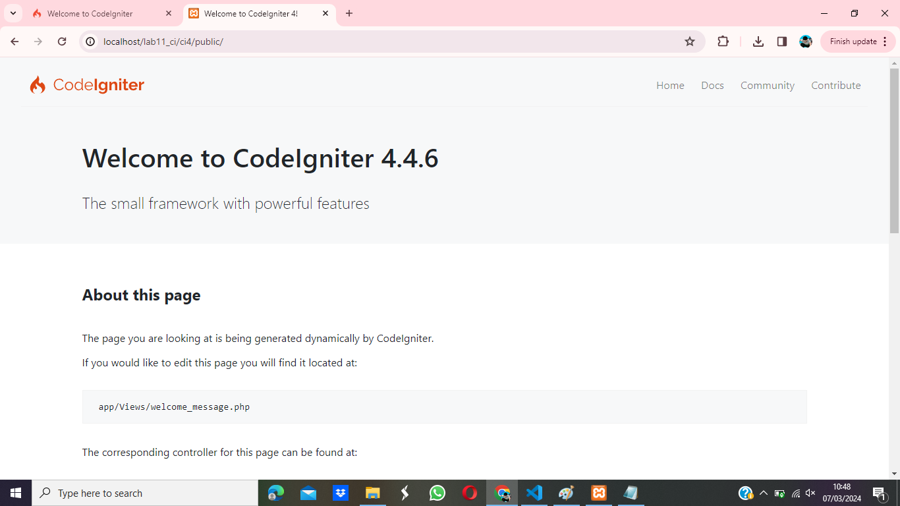

## Menjalankan CLI (Command Line Interface)

Codeigniter 4 menyediakan CLI untuk mempermudah proses development. Untuk mengakses CLI buka terminal/command prompt. Perintah yang dapat dijalankan untuk memanggil CLI Codeigniter adalah: php spark

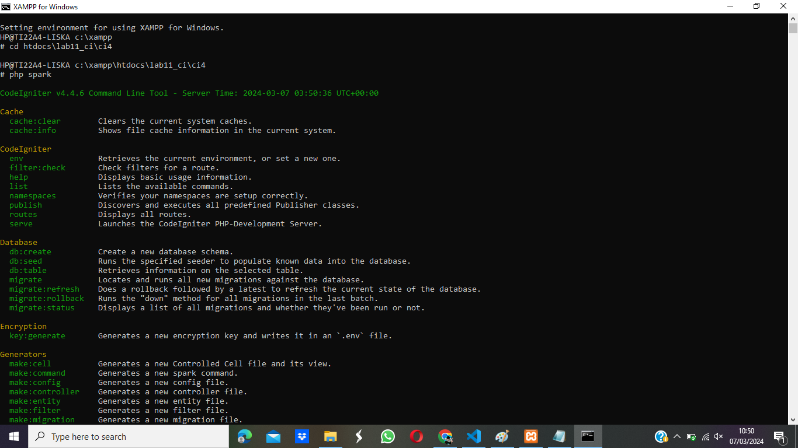

## Mengaktifkan Mode Debugging

Codeigniter 4 menyediakan fitur debugging untuk memudahkan developer untuk mengetahui pesan error apabila terjadi kesalahan dalam membuat kode program. Semua jenis error akan ditampilkan sama. Untuk memudahkan mengetahui jenis errornya, maka perlu diaktifkan mode debugging dengan mengubah nilai konfigurasi pada environment variable CI_ENVIRINMENT menjadi development.

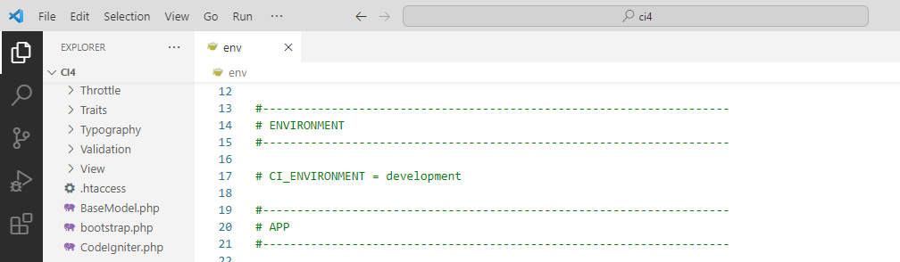

## Routing dan Controller

Routing merupakan proses yang mengatur arah atau rute dari request untuk menentukan fungsi/bagian mana yang akan memproses request tersebut. Pada framework CI4, routing bertujuan untuk menentukan Controller mana yang harus merespon sebuah request. Controller adalah class atau script yang bertanggung jawab merespon sebuah request.

1. Pada file tersebut kita dapat mendefinisikan route untuk aplikasi yang kita buat. Contoh:

```php
$routes->get('/', 'Home::index');
```

Kode tersebut akan mengarahkan rute untuk halaman home.
Membuat Route Baru.

2. Tambahkan kode berikut di dalam Routes.php

```php
$routes->get('/about', 'Page::about');
$routes->get('/contact', 'Page::contact');
$routes->get('/faqs', 'Page::faqs');
```

3. Untuk mengetahui route yang ditambahkan sudah benar, buka CLI dan jalankan perintah berikut.

`php spark routes`

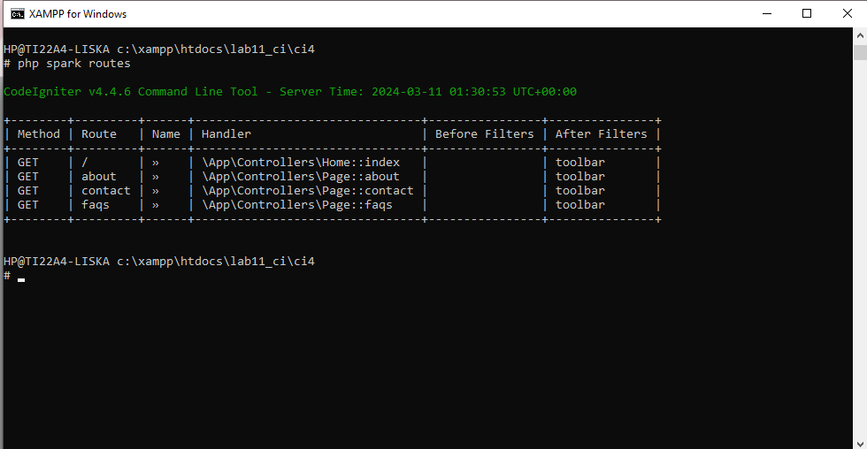

4. Selanjutnya coba akses route yang telah dibuat dengan mengakses alamat url

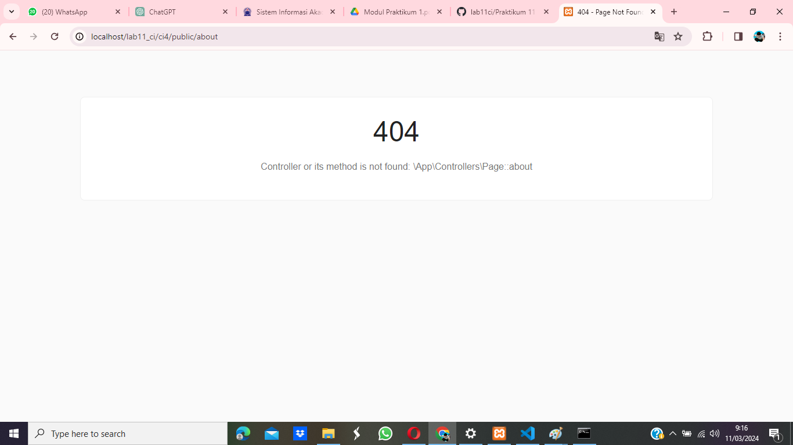

Ketika diakses akan mucul tampilan error 404 file not found, itu artinya file/page tersebut tidak ada. Untuk dapat mengakses halaman tersebut, harus dibuat terlebih dahulu Contoller yang sesuai dengan routing yang dibuat yaitu Contoller Page.

## Membuat Controller

1. Selanjutnya adalah membuat Controller Page. Buat file baru dengan nama page.php pada direktori Controller kemudian isi kodenya seperti berikut.

```php
<?php
namespace App\Controllers;
class Page extends BaseController
{
    public function about()
    {
        echo "Ini halaman About";
    }
    public function contact()
    {
        echo "Ini halaman Contact";
    }
    public function faqs()
    {
        echo "Ini halaman FAQ";
    }
}
```

2. Selanjutnya refresh Kembali browser, maka akan ditampilkan hasilnya yaitu halaman sudah dapat diakses.

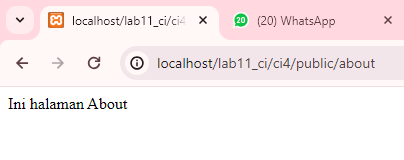

## Auto Routing

1. Secara default fitur autoroute pada Codeiginiter sudah aktif. Untuk mengubah status autoroute dapat mengubah nilai variabelnya. Untuk menonaktifkan ubah nilai true menjadi false.

`$routes->setAutoRoute(true);`

2. Tambahkan method baru pada Controller Page seperti berikut.

```php
public function tos()
{
echo "ini halaman Term of Services";
}
```

3. Method ini belum ada pada routing, sehingga cara mengaksesnya dengan menggunakan alamat:

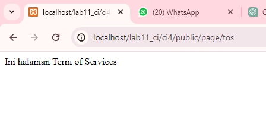

## Membuat View

1. Selanjutnya adalam membuat view untuk tampilan web agar lebih menarik. Buat file baru dengan nama about.php pada direktori view (app/view/about.php) kemudian isi kodenya seperti berikut.

```html
<!DOCTYPE html>
<html lang="en">
  <head>
    <meta charset="UTF-8" />
    <meta http-equiv="X-UA-Compatible" content="IE=edge" />
    <meta name="viewport" content="width=device-width, initial-scale=1.0" />
    <title><?= $title; ?></title>
  </head>
  <body>
    <h1><?= $title; ?></h1>
    <hr />
    <p><?= $content; ?></p>
  </body>
</html>
```

2. Ubah method about pada class Controller Page menjadi seperti berikut:

```php
public function about(){
    return view('about', [
        'title' => 'Halaman About',
        'content' => 'Ini adalah Halaman About yang menjelaskan tentang isi halaman, dibuat melalui Views'
    ]);
}
```

3. Kemudian lakukan refresh pada halaman tersebut.

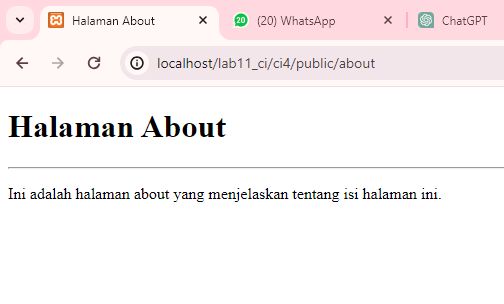

## Membuat Layout Web dengan CSS

Pada dasarnya layout web dengan css dapat diimplamentasikan dengan mudah pada
codeigniter. Yang perlu diketahui adalah, pada Codeigniter 4 file yang menyimpan asset css dan javascript terletak pada direktori public.

1. Buat file css pada direktori public dengan nama style.css
2. Kemudian buat folder template pada direktori view kemudian buat file header.php dan footer.php

- File app/view/template/header.php

```php
<!DOCTYPE html>
<html lang="en">
<head>
    <meta charset="UTF-8">
    <meta http-equiv="X-UA-Compatible" content="IE=edge">
    <meta name="viewport" content="width=device-width, initial-scale=1.0">
    <title><?= $title; ?></title>

    <link rel="stylesheet" href="https://cdn.jsdelivr.net/npm/bootstrap@4.3.1/dist/css/bootstrap.min.css">
    <script src="https://cdn.jsdelivr.net/npm/bootstrap@4.3.1/dist/js/bootstrap.min.js"></script>
    <style rel="stylesheet">
    * {
    margin: 0;
    padding: 0;
    }
    body {
        line-height:1;
        font-size:100%;
        font-family:'Open Sans', sans-serif;
        color:#5a5a5a;
    }
    /* header */
    header {
        padding: 20px;
    }
    header h1 {
        margin: 20px 10px;
        color: #b5b5b5;
    }
    </style>

</head>
<body>

<div class="container" style="box-shadow: 0 0 1em #cccccc">
    <div class="row">
        <header>
            <h1>Layout Sederhana</h1>
        </header>
    </div>
    <div class="row">
        <nav class="navbar navbar-collapse navbar-expand navbar-dark bg-primary">
            <div class="container-fluid">
                <div class="collapse navbar-collapse">
                    <ul class="navbar-nav" style="font-size: 14px; font-weight: bold;">
                        <li class="nav-item" style="padding-right: 15px;">
                            <a class="nav-link active" href="/">Home</a>
                        </li>
                        <li class="nav-item" style="padding-right: 15px;">
                            <a class="nav-item">
                                <a href="article" class="nav-link">Article</a>
                            </a>
                        </li>
                        <li class="nav-item" style="padding-right: 15px;">
                            <a class="nav-item">
                                <a href="about" class="nav-link">About</a>
                            </a>
                        </li>
                        <li class="nav-item" style="padding-right: 15px;">
                            <a class="nav-item">
                                <a href="contact" class="nav-link">Contact</a>
                            </a>
                        </li>
                    </ul>
                </div>
            </div>
        </nav>
    </div> <br>
    <div class="row">
```

- File app/view/template/footer.php

```php
<div class="col col-4">
            <ul class="list-group">
                <li class="list-group-item active fw-bolder" aria-current="true">Widget Header</li>
                <li class="list-group-item">Widget Link</li>
                <li class="list-group-item">Widget Link</li>
            </ul>

            <br><br>

            <div class="card mb-3" style="max-width: 18rem;">
                <div class="card-header text-white bg-primary fw-bolder">Widget Text</div>
                <div class="card-body">
                  Lorem ipsum dolor sit amet consectetur adipisicing elit. Ipsum quidem vitae mollitia suscipit dolores non deleniti, quis autem reiciendis eos, labore iure nam facilis minus id laborum maiores laboriosam ipsam?
                </div>
            </div>
        </div>
    </div>
    <div class="row">
        <div class="col-sm-12">
            <div class="card text-white bg-dark mb-1">
                <div class="card-body">
                    &copy; 2022 - Universitas Pelita Bangsa
                </div>
            </div>
        </div>
    </div>
</div>

</body>
</html>
```

- Kemudian ubah file app/view/about.php seperti berikut.

```php
<?= $this->include('template/header'); ?>

<div class="col-sm-8">
    <h1 style="font-weight: bold;"><?= $title; ?></h1>
        <hr>
    <p><?= $content; ?></p>
</div>
<?= $this->include('template/footer'); ?>
```

- Selanjutnya refresh tampilan website

  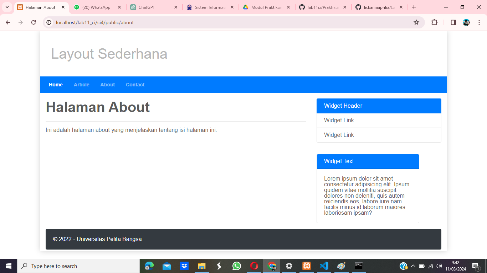
